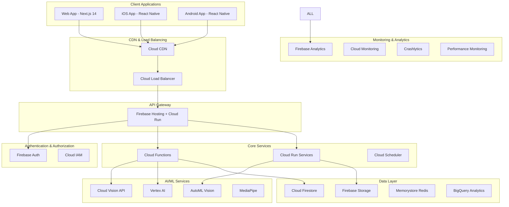
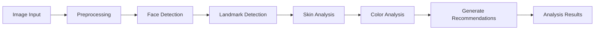
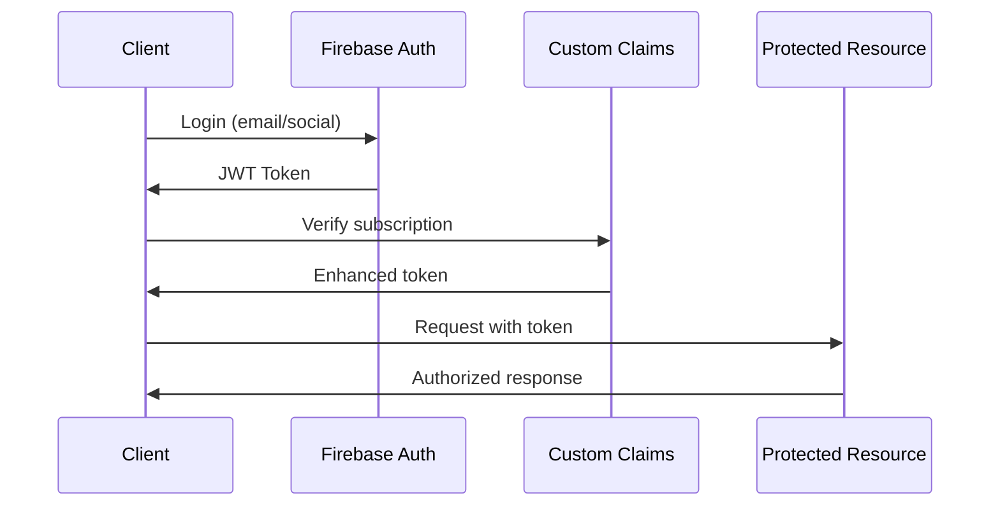

# 🏗️ **Beauty AI Platform - Technical Architecture**

## **System Architecture Overview**

The Beauty AI Platform is designed as a modern, scalable, cross-platform application leveraging Google Cloud services and advanced AI/ML capabilities. The architecture follows microservices patterns with a focus on performance, security, and maintainability.

## **High-Level Architecture Diagram**



## **Detailed Component Architecture**

### **1. Frontend Architecture**

#### **Cross-Platform Strategy**
- **Shared Business Logic**: 85%+ code sharing using TypeScript
- **Platform-Specific UI**: React DOM (Web) vs React Native (Mobile)
- **Universal State Management**: Zustand with platform adapters
- **Shared Design System**: Platform-adaptive components

#### **Web Application (Next.js 14)**
```typescript
// Architecture layers
src/
├── app/                 # App Router pages (Server Components)
├── components/          # Reusable UI components
│   ├── ui/             # Base design system components
│   ├── forms/          # Form components with validation
│   ├── beauty/         # Beauty-specific components
│   └── layout/         # Layout components
├── lib/                # Core utilities and configurations
│   ├── auth/           # Authentication utilities
│   ├── api/            # API client and hooks
│   ├── utils/          # Shared utilities
│   └── stores/         # State management
├── hooks/              # Custom React hooks
├── types/              # TypeScript type definitions
└── styles/             # Global styles and themes
```

#### **Mobile Application (React Native + Expo)**
```typescript
// Mobile-specific architecture
src/
├── screens/            # Screen components
├── navigation/         # Navigation configuration
├── components/         # Mobile-optimized components
├── services/           # Platform-specific services
│   ├── camera/         # Camera and AR services
│   ├── biometrics/     # Biometric authentication
│   └── permissions/    # Permission handling
├── native-modules/     # Custom native modules
└── assets/             # Images, fonts, and resources
```

### **2. Backend Architecture**

#### **Serverless Functions Architecture**
```typescript
// Cloud Functions structure
functions/
├── src/
│   ├── triggers/       # Database and storage triggers
│   │   ├── auth.ts     # Authentication triggers
│   │   ├── analysis.ts # Beauty analysis triggers
│   │   └── social.ts   # Social interaction triggers
│   ├── api/            # HTTP callable functions
│   │   ├── analysis/   # Beauty analysis endpoints
│   │   ├── products/   # Product management
│   │   ├── social/     # Social features
│   │   └── payments/   # Payment processing
│   ├── jobs/           # Scheduled functions
│   │   ├── analytics.ts # Analytics aggregation
│   │   ├── recommendations.ts # ML recommendations
│   │   └── cleanup.ts  # Data cleanup
│   └── utils/          # Shared utilities
├── models/             # AI/ML model files
└── tests/              # Function tests
```

#### **Cloud Run Services**
```yaml
# microservices.yaml
services:
  - name: beauty-analysis-service
    image: gcr.io/beauty-ai/analysis:latest
    resources:
      cpu: 2
      memory: 4Gi
    scaling:
      minInstances: 1
      maxInstances: 100
    
  - name: recommendation-engine
    image: gcr.io/beauty-ai/recommendations:latest
    resources:
      cpu: 1
      memory: 2Gi
    scaling:
      minInstances: 0
      maxInstances: 50
```

### **3. Data Architecture**

#### **Cloud Firestore Schema Design**
```typescript
// Database collections structure
interface DatabaseSchema {
  // User management
  users: {
    [userId: string]: UserProfile;
  };
  
  // Beauty analysis data
  analyses: {
    [analysisId: string]: BeautyAnalysis;
  };
  
  // Product catalog
  products: {
    [productId: string]: Product;
  };
  
  // Social features
  posts: {
    [postId: string]: SocialPost;
  };
  
  // Real-time features
  sessions: {
    [sessionId: string]: BeautySession;
  };
  
  // Analytics aggregation
  analytics: {
    daily: DailyAnalytics;
    monthly: MonthlyAnalytics;
  };
}
```

#### **Security Rules**
```javascript
// firestore.rules
rules_version = '2';
service cloud.firestore {
  match /databases/{database}/documents {
    // Users can only access their own data
    match /users/{userId} {
      allow read, write: if request.auth != null 
        && request.auth.uid == userId;
    }
    
    // Beauty analyses are private to users
    match /analyses/{analysisId} {
      allow read, write: if request.auth != null 
        && request.auth.uid == resource.data.userId;
    }
    
    // Products are publicly readable
    match /products/{productId} {
      allow read: if true;
      allow write: if request.auth != null 
        && request.auth.token.admin == true;
    }
    
    // Social posts with privacy controls
    match /posts/{postId} {
      allow read: if resource.data.visibility == 'public'
        || (request.auth != null && 
            request.auth.uid == resource.data.userId);
      allow write: if request.auth != null 
        && request.auth.uid == resource.data.userId;
    }
  }
}
```

### **4. AI/ML Architecture**

#### **Beauty Analysis Pipeline**


#### **Model Deployment Strategy**
```typescript
// Model configuration
interface MLModels {
  faceDetection: {
    type: 'MediaPipe';
    deployment: 'client-side';
    platform: ['web', 'mobile'];
  };
  
  skinAnalysis: {
    type: 'Custom TensorFlow';
    deployment: 'cloud';
    endpoint: 'vertex-ai';
  };
  
  colorMatching: {
    type: 'AutoML Vision';
    deployment: 'cloud';
    latency: '<500ms';
  };
  
  recommendations: {
    type: 'Collaborative Filtering';
    deployment: 'cloud-run';
    updateFrequency: 'daily';
  };
}
```

### **5. Performance Architecture**

#### **Caching Strategy**
```typescript
// Multi-layer caching
interface CachingLayers {
  CDN: {
    provider: 'Cloud CDN';
    ttl: '30 days';
    content: ['static assets', 'images', 'videos'];
  };
  
  Redis: {
    provider: 'Memorystore';
    ttl: '1 hour';
    content: ['API responses', 'user sessions', 'frequent queries'];
  };
  
  ClientSide: {
    provider: 'React Query';
    ttl: '5 minutes';
    content: ['API data', 'user preferences'];
  };
  
  ServiceWorker: {
    provider: 'Workbox';
    strategy: 'cache-first';
    content: ['app shell', 'critical resources'];
  };
}
```

#### **Image Optimization Pipeline**
```typescript
// Image processing workflow
const imageOptimization = {
  upload: {
    maxSize: '10MB';
    formats: ['JPEG', 'PNG', 'WebP'];
    validation: 'client + server';
  };
  
  processing: {
    resize: 'multiple sizes (thumbnail, medium, full)';
    format: 'WebP with JPEG fallback';
    compression: 'adaptive quality';
    CDN: 'global distribution';
  };
  
  analysis: {
    preprocessing: 'normalize + enhance';
    faceDetection: 'MediaPipe';
    skinAnalysis: 'Vertex AI';
    colorExtraction: 'Custom algorithm';
  };
};
```

### **6. Security Architecture**

#### **Authentication Flow**


#### **Data Protection Layers**
```typescript
interface SecurityLayers {
  transport: {
    protocol: 'HTTPS/TLS 1.3';
    certificates: 'Google-managed SSL';
    hsts: 'enabled';
  };
  
  application: {
    authentication: 'Firebase Auth + Custom Claims';
    authorization: 'RBAC with Firestore Rules';
    inputValidation: 'Zod schemas';
    outputSanitization: 'DOMPurify';
  };
  
  data: {
    encryption: 'AES-256 at rest';
    anonymization: 'Face data for ML training';
    retention: 'Automated cleanup policies';
    compliance: 'GDPR + CCPA ready';
  };
  
  infrastructure: {
    vpc: 'Private networking';
    iam: 'Least privilege principles';
    monitoring: 'Security audit logs';
    scanning: 'Vulnerability assessments';
  };
}
```

### **7. Monitoring & Observability**

#### **Metrics Collection**
```typescript
// Monitoring strategy
interface MonitoringStack {
  performance: {
    clientSide: {
      tool: 'Firebase Performance';
      metrics: ['Core Web Vitals', 'App start time', 'Network requests'];
    };
    
    serverSide: {
      tool: 'Cloud Monitoring';
      metrics: ['Function duration', 'Error rates', 'Memory usage'];
    };
  };
  
  userBehavior: {
    tool: 'Firebase Analytics';
    events: ['beauty_analysis', 'product_view', 'tutorial_complete'];
  };
  
  errors: {
    clientSide: 'Crashlytics';
    serverSide: 'Error Reporting';
    alerting: 'PagerDuty integration';
  };
  
  logs: {
    centralized: 'Cloud Logging';
    structured: 'JSON format';
    retention: '30 days';
  };
}
```

### **8. Scalability Considerations**

#### **Auto-scaling Configuration**
```yaml
# Cloud Run scaling
apiVersion: serving.knative.dev/v1
kind: Service
metadata:
  name: beauty-analysis
  annotations:
    run.googleapis.com/cpu-throttling: "false"
spec:
  template:
    metadata:
      annotations:
        autoscaling.knative.dev/minScale: "1"
        autoscaling.knative.dev/maxScale: "1000"
        autoscaling.knative.dev/targetConcurrencyUtilization: "70"
    spec:
      containerConcurrency: 100
      timeoutSeconds: 300
      containers:
      - image: gcr.io/beauty-ai/analysis:latest
        resources:
          limits:
            cpu: "2"
            memory: "4Gi"
```

#### **Database Scaling Strategy**
```typescript
// Firestore optimization
const scalingStrategy = {
  collections: {
    sharding: 'User-based for analyses';
    indexing: 'Composite indexes for queries';
    caching: 'Redis for frequent reads';
  };
  
  realtime: {
    listeners: 'Efficient query scoping';
    batching: 'Batch writes for efficiency';
    offline: 'Local persistence enabled';
  };
  
  analytics: {
    aggregation: 'Pre-computed daily/monthly stats';
    bigQuery: 'Complex analytics queries';
    streaming: 'Real-time data pipeline';
  };
};
```

### **9. Deployment Architecture**

#### **CI/CD Pipeline**
```yaml
# Complete deployment pipeline
stages:
  - name: test
    jobs:
      - unit-tests
      - integration-tests
      - security-scan
      - performance-test
  
  - name: build
    jobs:
      - build-web
      - build-mobile
      - build-functions
      - optimize-assets
  
  - name: deploy-staging
    jobs:
      - deploy-functions
      - deploy-web
      - run-e2e-tests
  
  - name: deploy-production
    jobs:
      - blue-green-deployment
      - health-checks
      - rollback-capability
```

#### **Multi-Environment Strategy**
```typescript
// Environment configuration
const environments = {
  development: {
    firebase: 'beauty-ai-dev';
    cloudRun: 'dev-cluster';
    features: 'all enabled';
    analytics: 'debug mode';
  };
  
  staging: {
    firebase: 'beauty-ai-staging';
    cloudRun: 'staging-cluster';
    features: 'production-like';
    analytics: 'test data';
  };
  
  production: {
    firebase: 'beauty-ai-prod';
    cloudRun: 'prod-cluster';
    features: 'stable only';
    analytics: 'real users';
  };
};
```

## **Technology Decision Matrix**

| Component | Technology | Rationale | Alternatives Considered |
|-----------|------------|-----------|-------------------------|
| Frontend Web | Next.js 14 | SSR, Performance, SEO | Nuxt.js, SvelteKit |
| Frontend Mobile | React Native | Code sharing, Native performance | Flutter, Ionic |
| Backend | Firebase + Cloud Run | Serverless, Scalability, Integration | Express.js, Nest.js |
| Database | Cloud Firestore | Real-time, Offline sync, NoSQL | PostgreSQL, MongoDB |
| AI/ML | Vertex AI + MediaPipe | Google ecosystem, Performance | AWS SageMaker, Azure ML |
| Storage | Firebase Storage | CDN integration, Security rules | Cloud Storage, AWS S3 |
| Auth | Firebase Auth | Multi-provider, Security | Auth0, AWS Cognito |
| Monitoring | Firebase + Cloud Monitoring | Integrated, Comprehensive | DataDog, New Relic |

This architecture provides a robust, scalable foundation for the Beauty AI Platform while maintaining flexibility for future enhancements and integrations.